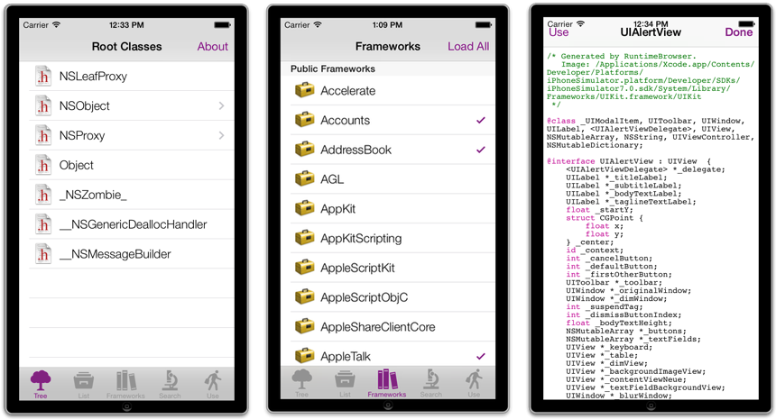
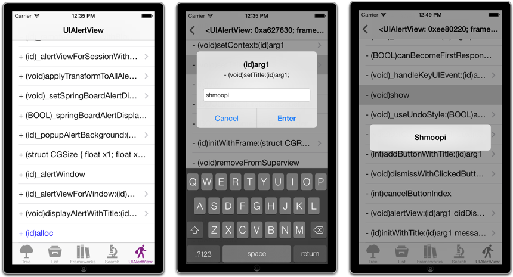

RuntimeBrowser
==============

This is a class browser for the Objective-C runtime on iOS and OS X. It gives you full access to all classes loaded in the runtime; allows you to dynamically load new modules and their classes; shows every method implemented on each class; and displays information in a header (.h) file format.

We have found this to be a useful development tool. Please note, however, that each user is responsible for their own usage.

The original version was released in April 2002 by [Ezra Epstein](https://github.com/eepstein). The project is maintained by Nicolas Seriot since August, 2008.

### iOS Version

  * browse by class tree, image or indexed list
  * search in classes names
  * headers retrieval through HTTP port 10000
  * instantiates most classes including allocation of non-shared instances
  * allows invocation of methods including inputting of parameters at runtime

You can browse the [iOS headers](https://github.com/nst/iOS-Runtime-Headers) as seen by RuntimeBrowser.

    
### OS X Version

Latest build: 2019-11-17 [http://seriot.ch/temp/RuntimeBrowser_0.996.zip](http://seriot.ch/temp/RuntimeBrowser_0.996.zip) 344 KB

  * browse by class tree, image, list or protocols
  * search in classes contents
  * syntax colorization
  * drag and drop frameworks and headers

